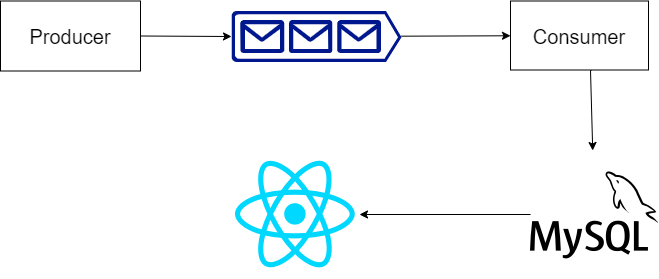

Hi,

Producer (Python): Producer send 10 POST messages to Redis queue every second.
Redis (Python and RQ): redis accepts POST messages from producers and send back to consumer as a post request.
Consumer (Python and Flaskapi): consumer received POST messages from redis queue and their arrival time. 
Database (MySql): The consumer container is storing the received POST requests in a database.
Frontend (React and nodeJS): It display max_count and avg time of last 10 sec posts.

There are total five containers are running in this application:
-	Producer
-	Consumer
-	Redis-server
-	Redis-worker
-	Frontend-react

To run example, we must need install docker and docker compose in system. 
Docker install steps (Linux):
-	sudo apt-get install apt-transport-https ca-certificates curl gnupg-agent software-properties-common
-	curl -fsSL https://download.docker.com/linux/ubuntu/gpg | sudo apt-key add –
-	sudo add-apt-repository "deb [arch=arm64] https://download.docker.com/linux/ubuntu $(lsb_release -cs) stable"
-	sudo apt-get update
-	sudo apt-get install docker-ce docker-ce-cli containerd.io

Docker compose install steps:
-	sudo curl -L "https://github.com/docker/compose/releases/download/1.27.4/docker-compose-$(uname -s)-$(uname -m)" -o /usr/local/bin/docker-compose
-	sudo chmod +x /usr/local/bin/docker-compose

After Install docker and docker compose
Start service using these commands: 
-	Docker-compose build
-	Docker-compose up
